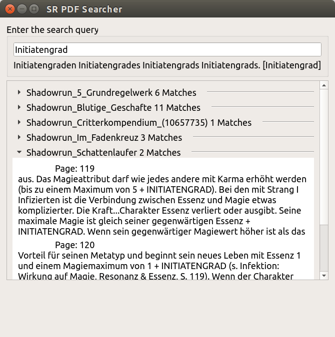

# SR PDF Crawler
This handy tool is used to quickly crawl through all the Shadowrun rulebooks you gathered over the years and give you that single pesky rule you just can't find.

At the initial startup an search index is built. This can take quite some time, especially on older systems. Afterwards the search is very fast.

### Building
- Check this for Windows textract : https://github.com/deanmalmgren/textract/issues/111
  - Download the linked zip and extract `pdftotext.exe` to the programs root
  - Add the file to the pyinstaller spec like this : `datas=[('pdftotext.exe', '.')],`
- `pip install https://github.com/pyinstaller/pyinstaller/archive/develop.zip` (PyInstaller currently does not support Python 3.6 on stable.)
- Read through https://github.com/pyinstaller/pyinstaller/issues/1566 and make sure you have done the following if on Windows:

        The following solved the problem for me (on Win10 v1607 - PyQt5 App):

        Add the directory of the required dlls to system Path. My application uses PyQt5 which is dependent on api-ms-win dlls.

        For PyQt5 add this directory: %WHERE EVER YOU INSTALLED PYTHON%\Lib\site-packages\PyQt5\Qt\bin

        For api-ms-win dlls you need Visual Studio 2015 OR Windows SDK (download here):
        Directory if you have Visual Studio: C:\Program Files (x86)\Microsoft Visual Studio 14.0\Common7\IDE\Remote Debugger\x64
        Directory if you have Windows SDK: C:\Program Files (x86)\Windows Kits\10\Redist\ucrt\DLLs\x64

    After you add the required paths, pyinstaller can find the files.
   
-  Build using pyinstaller -F gui.py

##### Common issues
- Recursion issues : Add the following to `gui.spec`

      import sys
      sys.setrecursionlimit(10000)
      
- `Failed to execute pyi_rth_qt5plugins` - Add your `PyQt5`-Path to pathex in the spec file e.g. `C:\Users\ricc\AppData\Local\Programs\Python\Python36\Lib\site-packages`
